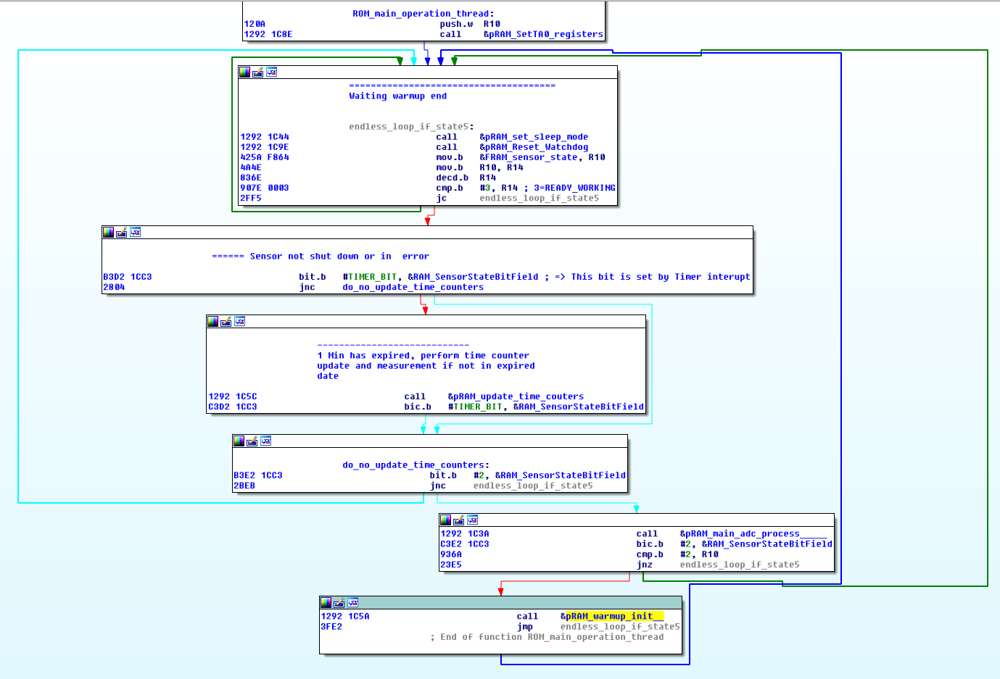

# Open Abbott FreeStyle Libre 14 days

**!! Stop waisting functional hardware devices !!**

OpenFreestyle is Abbott FreeStyle Libre 14 days glucose sensor reverse and sorftware framework project. 

Abbott diabete glycemy sensor is a "use and trash" electronic board and chipset thaugh after expiry it can be re-used for other purposes.

The sensor provides a Temperature probe and once the spike removed, exposes 2 pads that are linked to ADCs.

**Latest update** : Rebith of a dead sensor is functional ! Valid temperature measurements for about 10 days! 


!! **WARNING** **This project should not be used on functional or new sensors as it may damage the sensor. Only use expired sensors.**

## Sensor Reverse  

[See the complete reverse explanation.](./docs/reverse.md)


## Sensor software architecture

[See software explanation.](./docs/software.md)


## Framework installation

Tested only on linux-64 debian host.

```bash
# Python dependencies
sudo apt install python3-progressbar cmake
```

- Get msp430-gcc toolchain: [Mitto Systems GCC Linux - toolchain only](https://software-dl.ti.com/msp430/msp430_public_sw/mcu/msp430/MSPGCC/latest/index_FDS.html) (tested with msp430-gcc-8.3.0.16_linux64.tar.bz2)
- Unzip, and add build chain path to your .bashrc.

**WARNING** This toolchain doesn't support mixed Upper and Lower case in the paths... Your path must all be in lower case.

```bash
# Add toolchain path to your $PATH:
export PATH=$PATH:[/home/your_path/msp430-gcc-8.3.0.16_linux64/bin]

```
- Install [https://github.com/captainbeeheart/pypn5180](https://github.com/captainbeeheart/pypn5180) and test your connection with FTDI and PN5180 (Raspberry PI option not supported here, only PC => FTDI => PN5180)

## Build project and program sensor 

To test the 'FreeStyleHello' project on your expired sensor:

```bash
> mkdir build
> cd build
> cmake ..
> make 
> make upload
```
Note: Following warning is normal "cc1: warning: Unrecognized MCU name '/home/user/test/openfreestyle/toolchain/rf430frl152h_freestylelibre'"

Note: 'upload' command will first make a local copy of the FRAM, merge the elf binary sections in it and upload the new FRAM content.

Once done and ok, check the sensor new custom function:

```bash
> python3 -m pypn5180.pypn5180_15693 CUSTOM -c A5 -m 07 -d C2AD7521 -f PORT_A
Connecting to PN5180 device...
Conected to FTDI SPI ftdi://ftdi:2232h/1
PN5180 Self test:
 Firmware version: 0x305
 Product Version : 0x305
 EEPROM version  : 0x9100
 
Configuring device for ISO IEC 15693
[Transaction OK] SysInfo - chip serial: 'xxxxxxxxxxxxx'
Sending Code 0xa5 with [194, 173, 117, 33]
CMD a5: [Transaction OK] Data: [bytearray(b'Hello from FreeStyle Libre')] - [b'48656c6c6f2066726f6d20467265655374796c65204c69627265']

```


## Sensor re-birth

To re-enable a dead sensor, two patches are required:

1- A new NFC function **'nfcRebirthFuncA6'** in nfc_functions.c is available to put back the sensor in it's initial state. This function also disables the sensor CRCs checks flag (**fram_data.footer.bypassChecks**).

2- A patch function is added in the patch table to remove the warm-up phase that causes some issue when restarting the sensor.
When the two sensor activation functions are called (A1, A0), the sensor starts it's main thread endless loop and tries to executes it's calibration function for some minutes. As this phase ends in error, the patch function removes all the processing related to warmup and just switch the sensor state to 'running' after the first minute elapsed.




### Operation mode
```bash
> mkdir build
> cd build
> cmake ..
> make 
> make upload
```

Once done and ok, call the sensor activation functions A0 with the magic number as message payload.

Done ! Your sensor temperature measurement will be operational again for about 10 days !!


## TODO

Only a few ROM functions are documented for the moment.

Next release of API target is to demonstrate temperature sensor re-use and evaluate remaining battery life.